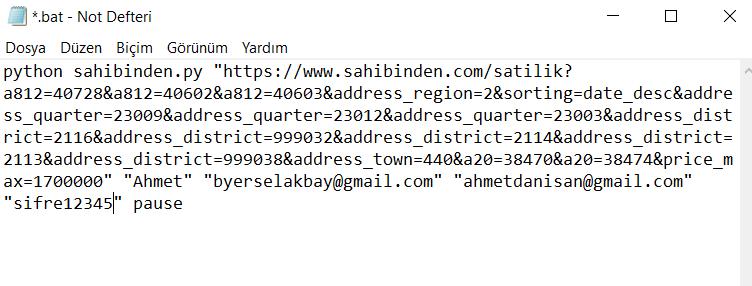
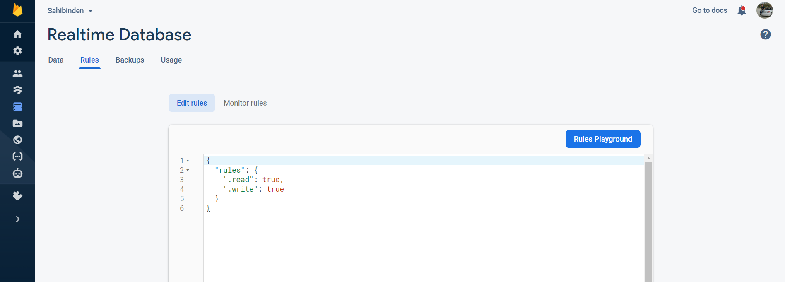
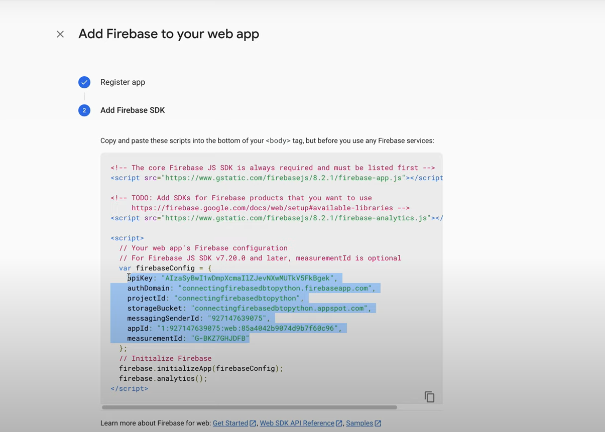

# Sahibinden House Checker

-ENG- 

Sahibinden House Checker is a project created with python using selenium, which constantly checks sahibinden.com ads that meet the user's criteria, and notifies the user via e-mail when a new ad is posted.

-TR-
 
Sahibinden House Checker, kullanıcının kriterlerine uygun sahibinden.com ilanlarını devamlı kontrol eden, yeni ilan yayınlandığında mail ile kullanıcıyı bilgilendiren selenyum kullanarak python ile oluşturulmuş bir projedir.

## Use With .bat
python online.py "sahibinden.com url edited according to your criteria" "name of the person to be addressed" "sender e-mail address" "recipient's e-mail address" "sender's email password"
pause

-ENG- 

-Change the contents of the .bat file in the folder as in the example image without having to write commands for python with cmd.
(Only one url should be written. Multiple urls are not supported.)

-save the changed file

-run the .bat file by double clicking on it

Thats All. The program will automatically find new house listings that meet your criteria and send you an e-mail.

Note: All installations related to python, selenium, firebase, pyrebase must be completed for the program to work.

Note: If anyone is getting a "smtplib.SMTPAuthenticationError" try the following steps:

 https://www.youtube.com/watch?v=D-NYmDWiFjU
 
!! Note this makes your email vulnerable to attacks and I do not stand liable for any loss or damage. !!

-TR-  

-Cmd ile python için komut yazmak zorunda kalmadan, örnek görüntüdeki gibi klasördeki .bat dosyasının içeriğini değiştirin. 
(Yalnızca tek bir sahibinden linki yazılmalıdır. Birden fazla link desteklenmemektedir.)

-Değiştirilen dosyayı kaydedin.

-.bat dosyasını çift tıklayarak çalıştırın

Hepsi bu kadar. Program, kriterlerinize uygun yeni ev ilanlarını otomatik olarak bulacak ve size bir e-posta gönderecektir.

Not: Programın çalışması için python, selenium, firebase ve pryrebase ile ilgili tüm kurulumların tamamlanması gerekir.

Not: Eğer "smtplib.SMTPAuthenticationError" alıyorsanız aşağıdaki adımları deneyin:

 https://www.youtube.com/watch?v=D-NYmDWiFjU
 
!! Bunun e-postanızı saldırılara karşı savunmasız hale getirdiğini ve herhangi bir kayıp veya hasardan sorumlu olmadığımı unutmayın. !!

## Details About Firebase Database

**Firebase Settings:**

